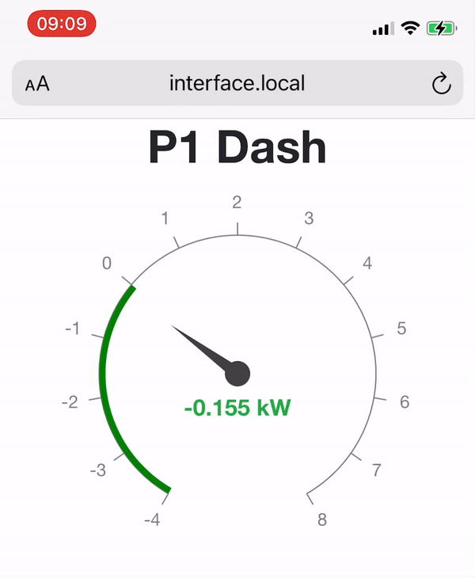

# P1 Dash



A simple web interface for the Dutch Smart Meter reader (DSMR/ESMR v5).
Right now it does only one thing; display a guage to show you the
power consumed from or fed back to the grid in real time.

## Run with Docker

With FTDI cable connected as /dev/ttyUSB0

```
docker build -t p1dash .
docker run -p 5000:5000 --device /dev/ttyUSB0 p1dash
```

If a serial port is not available, DSMR data can be consumed from
any TCP socket, serviced by something like ser2net or a dedicated
smart meter interface.

Configuration is not yet available.
